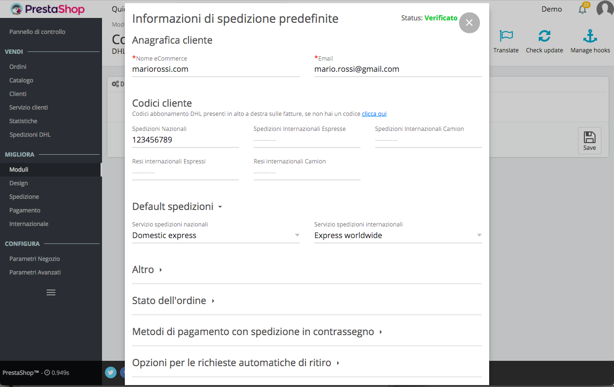
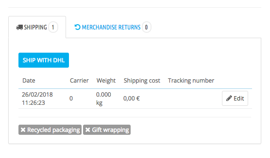
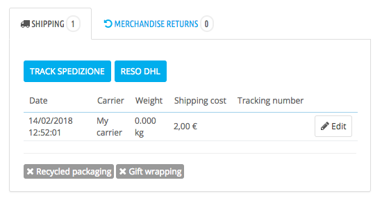

DHL Express extension for Prestashop
===========================

## Installation Instructions

### Module Configuration

During the installation of the module, the SOAP user is created and the credentials are automatically saved in configuration

Under Modules -> Installed modules, find DHL shipping

Click on configure and then on Update config to enter and modify the configurations. Each configuration can be modified for the single shipment from the order page

### Options

__1__ __Default shipping settings__

- Insert the DHL user code in the required __User Code__ field required
- __Number of packages__ to ship
- __Weight__ and __volume__ 
- Default Label format required
- Default __domestic__ and __international__ service
- __Insurance__ set yes to enable
- Short __package description__

__2__ __Order Status__

- The user can select between all the order states of the current Prestashop instance those in which it is possible to start a shipment. 
The shipment button will be present on the order page only if the order is in one of the selected states.

__3__ __Cash on delivery options__

- Select all payment methods that provides Cash on delivery
- Select the default cashout mode for the Cash on delivery

__4__ Parameters for __automatic pick up__

- Set Yes to enable __automatic pick up__
- Maximum time for pick-up requirement in a day (from 10 to 14)
- Ready for goods Time (from 14 to 18)

__5__ __Default sender__ data

### Creation of the shipment

The user can create a shipment from the order page. 
If the order status is among those enabled in the configuration the button 'Ship with DHL' will appear in the order page. 

Clicking on the button will open a modal to confirm or change the shipping configurations. The content of the modal is provided by the DHL platform.

### Return

The button to start the return will appear on the order page only after a shipment has already been created. 

