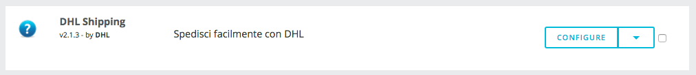
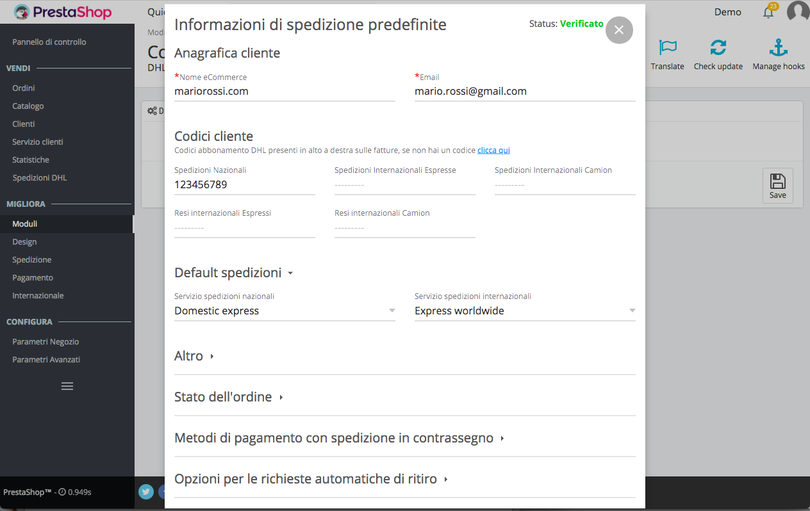
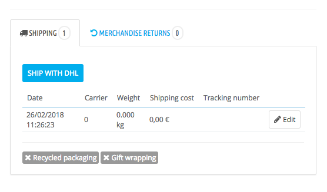

Modulo ufficiale DHL Express per Prestashop
===========================

## Instruzioni di installazione

### Configurazione modulo

Durante l'installazione del modulo, l'utente SOAP viene creato e le credenziali sono automaticamente salvate nelle configurazioni.

Sotto "Moduli" -> "Installed Modules", trovi "DHL shipping"

Clicca su "configure" e quindi su "Update config" per accedere al pannello di configurazione. Ogni configurazione potrà essere modificata per la singola spedizione dalla pagina di dettaglio ordine.

### Opzioni

__1__ __Default spedizioni__

- Inserisci i codici cliente nei campi __User Code__, almeno uno è obbligatorio
- __Numero di colli__ da spedire
- __Peso__ e __Volume__ 
- __Tipo stampante__ è un campo obbligatorio
- I servizi __nazionali__ ed __internazionali__ da utilizzare di default
- __Assicurazione__ seleziona "Abilitata" per attivarla
- Una breve descrizione del collo

__2__ __Stati ordine__

- L'utente può selezionare tra tutti gli stati di ordine dell'istanza di Prestashop corrente quelli in cui è possibile avviare una spedizione.
Il pulsante spedizione sarà presente nella pagina dell'ordine solo se l'ordine è in uno degli stati selezionati.

__3__ __Opzioni contrassegno__

- Seleziona tutti i metodi di pagamento che prevedono il pagamento alla consegna
- Seleziona la modalità di incasso predefinita per il pagamento alla consegna

__4__ __Parametri per l'invio automatico delle richieste di ritiro__

- Imposta Si per abilitare __Ritiro automatico__
- Limite evasione ordini per richiedere il ritiro in giornata (da 10 a 14)
- Orario pronta merce (dalle 14:00 alle 18:00)

__5__ Dati del __mittente predefinito__

### Creazione della spedizione

L'utente può creare una spedizione dalla pagina dell'ordine.
Se lo stato dell'ordine è tra quelli abilitati nella configurazione, il pulsante "Spedisci con DHL" apparirà nella pagina dell'ordine.

Cliccando sul pulsante si aprirà una modale per confermare o modificare le configurazioni di spedizione. Il contenuto del modale è fornito dalla piattaforma DHL.

### Return

Il pulsante per avviare il reso apparirà nella pagina dell'ordine solo dopo che una spedizione è già stata creata. 

